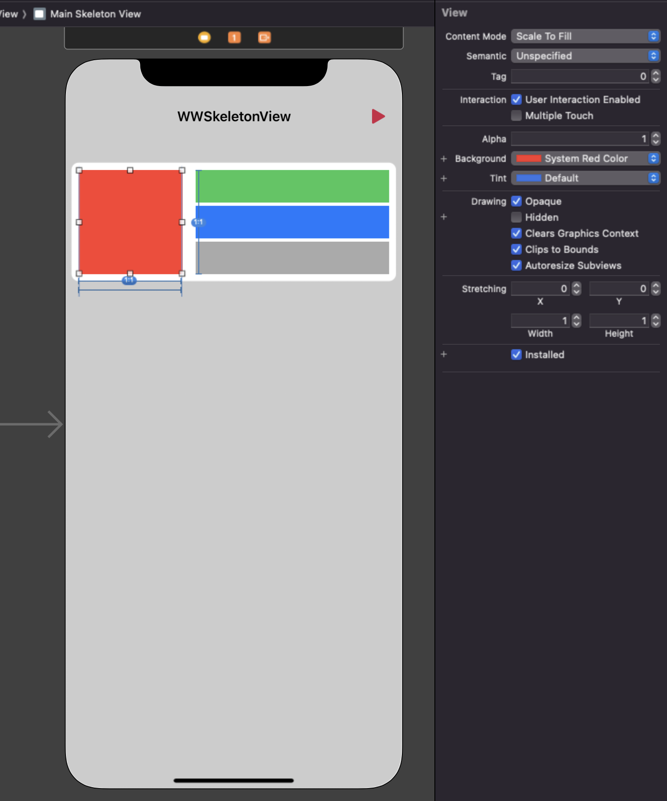

# WWSkeletonView
[](https://developer.apple.com/swift/) [](https://developer.apple.com/swift/)  [](https://developer.apple.com/swift/) [](https://developer.apple.com/swift/)

### [Introduction - 簡介](https://swiftpackageindex.com/William-Weng)
- Simply imitate the HTML Skeleton Screen function.
- 簡單的模仿HTML Skeleton Screen功能。.


### [Installation with Swift Package Manager](https://medium.com/彼得潘的-swift-ios-app-開發問題解答集/使用-spm-安裝第三方套件-xcode-11-新功能-2c4ffcf85b4b)

```bash
dependencies: [
    .package(url: "https://github.com/William-Weng/WWSkeletonView.git", .upToNextMajor(from: "1.0.3"))
]
```



### Function - 可用函式
|函式|功能|
|-|-|
|start(duration:)|動畫開始|
|stop()|動畫停止|

### Example
```swift
final class ViewController: UIViewController {

    @IBOutlet weak var mainSkeletonView: WWSkeletonView!
    @IBOutlet var labelSkeletonViews: [WWSkeletonView]!
    
    override func viewDidLoad() {
        super.viewDidLoad()
    }
    
    @IBAction func start(_ sender: UIBarButtonItem) {
        mainSkeletonView.start(duration: 2.0)
        labelSkeletonViews.forEach { $0.start() }
    }
}
```
